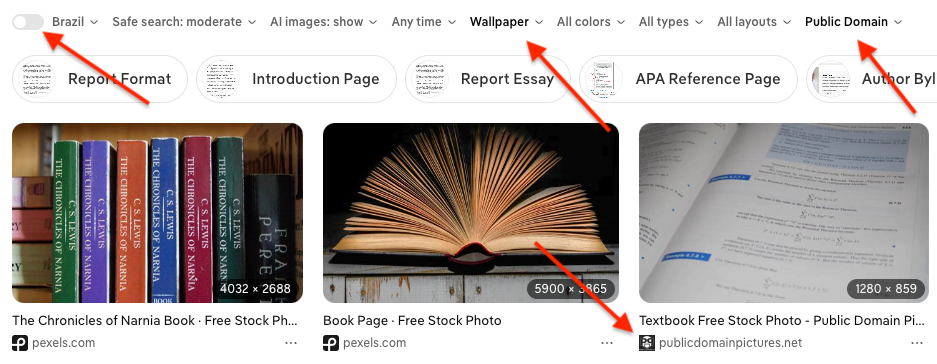

# sdet-automation-test
#### Version: 3

### What is Expected?

This is a code challenge to test your skills related to the development of automated tests. We use Selenium, Pytest and
Allure, but feel free to use any framework you are familiar with, as long as you develop it using Python.

The test consists in some steps to interact with a web page and assert some conditions, generating a report with the
test result after the execution.

## Test Scenario

For this test you should follow the steps:
1. Go to [DuckDuckGo](https://duckduckgo.com/).
2. Search for "**book {BOOK_NAME}**" (e.g: The miserable, Blindness...).
3. Select images.
4. Disable country location filter, if enabled, to allow find from any country
5. Choose **Wallpaper** size filter.
6. Choose Public Domain license filter.
7. Validate third image found is **publicdomainpictures.net** and the image is bigger than 1000x1000 pixels.
 

### Implementation Requirements
1. Use Page Object Model (POM) to implement the page interactions.
2. If you have experience with:
    1. use data [parametrization](https://docs.pytest.org/en/stable/example/parametrize.html), instead hard coded data.
    2. If possible, use [Fixtures](https://docs.pytest.org/en/stable/how-to/fixtures.html) (or something like) to go to 
   the page and perform the search (i.e. first two steps).

## Repository

You will need to fork the repository and build the solution in Github publicly. Once you are finished, share your
repository with us. 

We expect this to be finished in one week  (in fact, some dedicated hours might be enough), but if anything happens
and this deadline cannot be met, reach out, so we know what is happening instead of think that you are not interested
in this position anymore.

## Deliverables
* Code in a public Github repository.
* README.md file with the notes, documentation, and instructions related to the code developed.
* The test execution should do the above steps and generate a report with the tests results. In case of a test failure,
it should also **attach a screenshot** of the current page when the test failed.
